# SmartEstate — Entity-Relationship Diagram

Generated from [`apps/api/prisma/schema.prisma`](../../apps/api/prisma/schema.prisma) by
`pnpm erd`. Do not edit by hand; CI fails when this file is out of date.

Legend: `PK` primary key · `FK` foreign key · `UK` unique · `"nullable"` optional column.
Relation lines are drawn from the table that owns the foreign key; `||` required parent,
`|o` optional parent, `o{` many children, `o|` at most one child.
`geometry` columns are PostGIS (SRID 4326); `vector` is pgvector (768 dimensions).

```mermaid
erDiagram
  users {
    uuid id PK
    citext email UK
    string password_hash
    Role role
    Locale locale
    boolean is_active
    timestamptz created_at
    timestamptz updated_at
  }
  profiles {
    uuid user_id PK, FK
    string display_name
    string phone "nullable"
    bigint budget_min_amd "nullable"
    bigint budget_max_amd "nullable"
    int_array preferred_rooms
    string commute_anchor_label "nullable"
    jsonb priorities
    timestamptz onboarding_completed_at "nullable"
    timestamptz updated_at
  }
  refresh_tokens {
    uuid id PK
    uuid user_id FK
    uuid family_id
    string token_hash UK
    timestamptz expires_at
    timestamptz revoked_at "nullable"
    uuid replaced_by "nullable"
    string user_agent "nullable"
    inet ip_address "nullable"
    timestamptz created_at
  }
  districts {
    uuid id PK
    string slug UK
    DistrictKind kind
    string name_hy
    string name_ru
    string name_en
    string city
    string marz
    Marz marz_code
    boolean is_border_settlement
    string osm_type "nullable"
    bigint osm_id "nullable"
  }
  points_of_interest {
    uuid id PK
    PoiCategory category
    string name_hy "nullable"
    string name_ru "nullable"
    string name_en "nullable"
    string osm_type "nullable"
    bigint osm_id "nullable"
    uuid district_id FK "nullable"
  }
  street_aliases {
    uuid id PK
    string canonical
    citext alias UK
    Locale locale "nullable"
  }
  buildings {
    uuid id PK
    uuid district_id FK
    string address_line
    string street_hy
    string street_ru
    string street_en
    string house_number
    BuildingType building_type
    int construction_year
    int total_floors
    boolean has_elevator
    boolean seismic_retrofit
    timestamptz created_at
  }
  listings {
    uuid id PK
    string public_id UK
    uuid building_id FK
    uuid district_id FK
    uuid created_by_id FK "nullable"
    string source
    string source_ref "nullable"
    ListingStatus status
    timestamptz submitted_at "nullable"
    timestamptz reviewed_at "nullable"
    uuid reviewed_by_id FK "nullable"
    string rejection_reason "nullable"
    bigint price_amd
    boolean price_negotiable
    Currency original_currency
    decimal original_price "nullable"
    int price_per_sqm_amd
    decimal total_area
    decimal living_area "nullable"
    decimal kitchen_area "nullable"
    int rooms
    int bathrooms
    decimal ceiling_height "nullable"
    int floor
    int balcony_count
    boolean has_loggia
    boolean has_parking
    boolean has_storage
    Condition condition
    HeatingType heating
    OwnershipDocsStatus ownership_docs
    timestamptz published_at
    timestamptz created_at
    timestamptz updated_at
  }
  listing_translations {
    uuid listing_id PK, FK
    Locale locale PK
    string title
    string description
    TranslationSource source
    boolean is_reviewed
    timestamptz updated_at
  }
  listing_embeddings {
    uuid listing_id PK, FK
    string model_version
    string source_hash
    timestamptz created_at
  }
  listing_price_history {
    uuid id PK
    uuid listing_id FK
    bigint price_amd
    timestamptz recorded_at
  }
  media {
    uuid id PK
    uuid listing_id FK
    MediaKind kind
    string url
    int width "nullable"
    int height "nullable"
    int sort_order
    string perceptual_hash "nullable"
    boolean is_placeholder
    timestamptz created_at
  }
  exchange_rates {
    uuid id PK
    date date
    Currency currency
    decimal rate_to_amd
    string source
    timestamptz created_at
  }
  district_market_snapshots {
    uuid id PK
    uuid district_id FK
    date period_start
    int median_price_per_sqm_amd
    int mean_price_per_sqm_amd
    int median_rent_per_sqm_amd "nullable"
    int listing_count
  }
  tax_refund_rule_sets {
    uuid id PK
    int version UK
    date effective_from
    date effective_to "nullable"
    string description
    jsonb rules
    timestamptz created_at
  }
  valuation_records {
    uuid id PK
    uuid listing_id FK
    string model_version
    bigint fair_price_amd
    bigint lower_bound_amd
    bigint upper_bound_amd
    decimal deviation_pct
    ValuationVerdict verdict
    jsonb top_factors
    uuid exchange_rate_id FK "nullable"
    timestamptz created_at
  }
  recommendation_sessions {
    uuid id PK
    uuid user_id FK "nullable"
    string anonymous_id "nullable"
    RankingStrategy strategy
    string experiment_key "nullable"
    string arm "nullable"
    jsonb preferences
    jsonb results
    jsonb llm_trace "nullable"
    timestamptz created_at
  }
  experiments {
    uuid id PK
    string key UK
    string name
    string description
    jsonb arms
    boolean is_active
    timestamptz created_at
  }
  user_interactions {
    uuid id PK
    uuid user_id FK "nullable"
    string anonymous_id "nullable"
    uuid listing_id FK
    InteractionType type
    int value "nullable"
    uuid session_id "nullable"
    timestamptz created_at
  }
  favorites {
    uuid user_id PK, FK
    uuid listing_id PK, FK
    timestamptz created_at
  }
  saved_searches {
    uuid id PK
    uuid user_id FK
    string name
    jsonb filters
    boolean alerts_enabled
    timestamptz last_notified_at "nullable"
    timestamptz created_at
    timestamptz updated_at
  }
  comparisons {
    uuid id PK
    uuid user_id FK
    string name "nullable"
    timestamptz created_at
    timestamptz updated_at
  }
  comparison_items {
    uuid comparison_id PK, FK
    uuid listing_id PK, FK
    int position
  }
  reviews {
    uuid id PK
    string author_name
    ReviewerRole author_role
    string body
    Locale locale
    ReviewStatus status
    timestamptz created_at
    timestamptz hidden_at "nullable"
    uuid hidden_by_id FK "nullable"
  }
  audit_logs {
    uuid id PK
    uuid actor_id FK "nullable"
    string action
    string entity_type
    string entity_id "nullable"
    jsonb metadata
    inet ip_address "nullable"
    timestamptz created_at
  }

  buildings ||--o{ listings : "building"
  comparisons ||--o{ comparison_items : "comparison"
  districts |o--o{ points_of_interest : "district"
  districts ||--o{ buildings : "district"
  districts ||--o{ district_market_snapshots : "district"
  districts ||--o{ listings : "district"
  exchange_rates |o--o{ valuation_records : "exchangeRate"
  listings ||--o{ comparison_items : "listing"
  listings ||--o{ favorites : "listing"
  listings ||--o{ listing_price_history : "listing"
  listings ||--o{ listing_translations : "listing"
  listings ||--o{ media : "listing"
  listings ||--o{ user_interactions : "listing"
  listings ||--o{ valuation_records : "listing"
  listings ||--o| listing_embeddings : "listing"
  users |o--o{ audit_logs : "actor"
  users |o--o{ listings : "createdBy"
  users |o--o{ listings : "reviewedBy"
  users |o--o{ recommendation_sessions : "user"
  users |o--o{ reviews : "hiddenBy"
  users |o--o{ user_interactions : "user"
  users ||--o{ comparisons : "user"
  users ||--o{ favorites : "user"
  users ||--o{ refresh_tokens : "user"
  users ||--o{ saved_searches : "user"
  users ||--o| profiles : "user"
```

